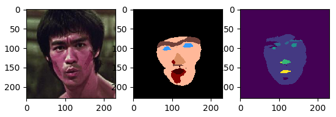
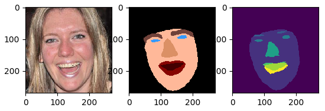
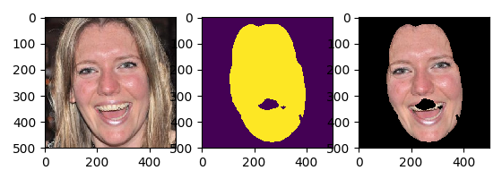
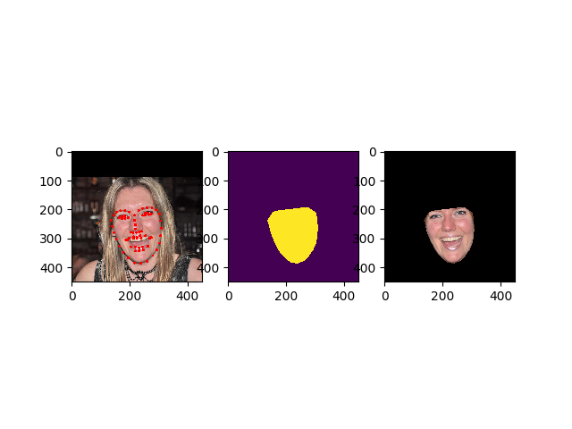

# Face segmentation with CNN and CRF

We try different methods to complete face segmentation:
- [A CNN Cascade for Landmark Guided Semantic Part Segmentation](https://arxiv.org/pdf/1609.09642.pdf). Models and more details please refer to Aaron Jackson's [website](https://aaronsplace.co.uk/papers/jackson2016guided/index.html). We add CRF as postprocessing. CRF is implemented by [pydensecrf](https://github.com/lucasb-eyer/pydensecrf). 
- [On Face Segmentation, Face Swapping, and Face Perception](https://arxiv.org/abs/1704.06729). Original [codes and models](https://github.com/YuvalNirkin/face_segmentation).
- Landmarks detection and convex hull generation.

## Codes
- face_segment_part.py: A CNN Cascade for Landmark Guided Semantic Part Segmentation.
- face_segment_yuval.py: On Face Segmentation, Face Swapping, and Face Perception.
- face_segment_contour.py: Detected landmarks and get convex hull.

## Dependencies
Please download [caffe](http://caffe.berkeleyvision.org/), minimum version: 1.0 for face_segment_yuval.py, download [caffe-future](http://aaronsplace.co.uk/papers/jackson2016guided/index.html) for face_segment_part.py

## Results
- face_segment_part:

- face_segment_yuval:

- face_segment_contour:

## TODO
- [ ] Add landmark detection in face_segment_contour.py
- [x] Contour -> segment
- [x] Unify code style
- [ ] Improve CRF results
- [x] Add example images to README
- [ ] Compare results of all methods
